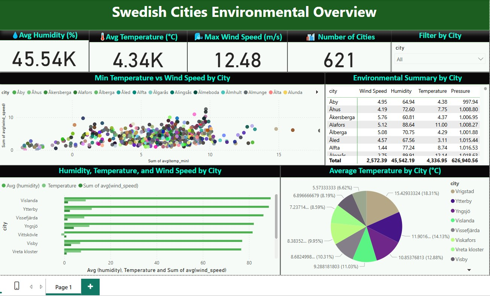

# Swedish-Cities-Environmental-Overview
Swedish Cities Environmental Overview is a Power BI dashboard analyzing data from 621 cities in Sweden. It focuses on average temperature, humidity, wind speed, and pressure, helping users explore climate patterns and identify outliers through interactive visuals.

# Swedish Cities Environmental Overview

.

[🔗 View the Interactive Power BI Dashboard](Swedish Cities Environmental Overview.pbix)  

---

## Project Overview

**Swedish Cities Environmental Overview** is a Power BI dashboard analyzing data from **621 cities** in Sweden. It focuses on average **temperature**, **humidity**, **wind speed**, and **atmospheric pressure**, helping users explore climate patterns and identify environmental outliers through clean, interactive visuals.

The data is based on daily averages, environmental day transformations, and weekly summaries. It was sourced from the Swedish government datasets via Kaggle, and used purely for learning and practice purposes.

---

## About Me

I’m **Sri Charan Ananthula**, a Bio-Technology graduate (2021–2024) from BJR Government Degree College, Osmania University, Hyderabad, India. I currently work as a Talent Acquisition Specialist at Swift Strategic Solutions Inc., Irvine, California, USA.

I'm transitioning into a career as a **Data Analyst**, with a strong interest in **environmental** and **healthcare data analysis**. This project showcases my skills in Power BI and data storytelling, with the goal of attracting opportunities from recruiters, companies, and freelance clients.

---

## Key Highlights

📊 **Key Metrics Summary**

- **Average Humidity (%):** 45,542.19 (cumulative — average per city ~73.35%)  
- **Average Temperature (°C):** 4,336.95 (total — actual average per city ~7°C)  
- **Maximum Wind Speed (m/s):** 12.48  
- **Number of Cities:** 621  

🔍 **Detailed Observations**

- 🌡️ **Temperature vs Wind Speed:** Most cities range from 0–10°C; outliers with 15°C show higher wind speeds.
- 🌬️ **City Highlights:** Åhus and Åkersberga show higher humidity and temperature.
- 📉 **Variation Chart:** Vislanda, Ytterby, and Växjö show large humidity and wind differences.
- 🥧 **Temperature Contribution:** Vrigstad (18.13%), Ytterby (14.13%), and Visby (12.18%) have the highest contribution to average temperature.

---

## Target Audience

This project is aimed at:
- Recruiters and hiring managers in data and analytics roles.
- Companies working in the **environmental** or **healthcare** sectors.
- Freelancers or clients looking for impactful, well-designed dashboards.

---

## Relevant Job Titles

This project aligns with skills required in roles such as:

- **Environmental Data Analyst**  
- **Business Intelligence Analyst**  
- **Power BI Developer**

---

## Tools & Technologies Used

- **Power BI Desktop** – Data modeling and visualization  
- **Excel** – Data cleaning  
- **JSON Theme File** – Applied custom visual theme  
- **Kaggle Datasets** – Source of environmental data (Swedish government)

---

## How to Use

1. Open the `SwedishCitiesDashboard.pbix` file using Power BI Desktop.
2. Use slicers to filter by city or environmental condition.
3. Explore interactive visuals like bar charts, pie charts, and summary cards.
4. Replace the dataset or extend it for further analysis if needed.

---

## Future Plans

- Expand this project to include live or real-time weather APIs.
- Create a similar dashboard for healthcare-related datasets.
- Use this project as part of a larger **portfolio** for freelancing and job applications.

---

## Contact

**Sri Charan Ananthula**  
📫 sricharan.ananthula@gmail.com
🔗 [https://www.linkedin.com/in/sri-charan-021450326/)  
🌍 Based in India | Open to freelance and full-time roles

---

*Thank you for viewing my project!*

